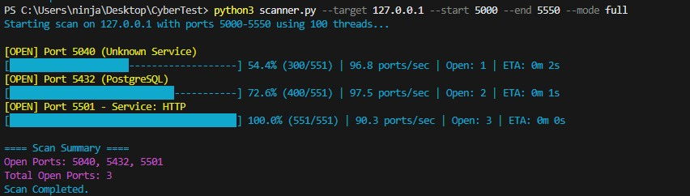

# 🔎 Python Port Scanner (Localhost)


## ⚙️ Installation

### 1. Clone the repository
```bash
git clone https://github.com/Brandonp584/Python-Port-Scanner.git

cd YOUR_REPO_NAME
```

### 2. Ensure Python is installed
This Project requires:
```bash
Python 3.x
```

Check your version:
```bash
python --version
```

### 3. Install dependencies
```bash
pip install colorama
```

## 🚀 Quick Start

Run the scanner with default settings:
```bash
python scanner.py
```
Or run a custom scan:
```bash
python scanner.py --target 127.0.0.1 --start 1 --end 1000
```
## ✨ Features

### - ⚡ Fast Multi-threaded Scanning
    Scan thousands of ports quickly using ThreadPoolExecutor

### - 🔍 Smart Service Detection
    Identifies common services like HTTP, SSH, FTP, SMB, and more

### -  🛰️ Banner Grabbing
    Attempts to detect running services by analyzing responses

### -  🎯 Custom Port Scanning (CLI)
    Easily define target IP and port ranges from command line

### -  🖥️ Clean Output + Colored Output
    Displays only ports with readable service information with colored highlighting

### - 💾 File Output Support
    Optionally save results to a file

### -  🔒 Safe by Design
    Defaults to localhost (127.0.0.1) for secure testing

## 📌 Overview

This is a Python-based port scanner that identifies open ports on your local machine (127.0.0.1).

It includes:

⚡ Multi-threaded scanning for speed
🔍 Basic service detection (smart port mapping)
🛰️ Banner grabbing for identifying services

Built for learning, experimentation, and safe local testing.

## ⚡ Command-Line Interface (CLI)

You can now run scans without modifying the code.

### 📸 Example Output


### 🧠 What I Learned
Through building this project, I gained hands-on experience with:
- TCP socket communication and port behavior
- Multi-threading and performance optimization
- Handling race conditions using locks
- Real-time progress tracking and ETA calculations
- Writing clean, user-friendly CLI tools
- Basic service fingerprinting and banner grabbing

This project helped bridge the gap between theory and real-world cybersecurity tools.

### ⚙️ Performance Notes
- Uses ThreadPoolExecutor for high-speed concurrent scanning
- Optimized progress updates (updates every 50 ports to reduce flickering)
- Adjustable thread count for balacing speed vs system load
- Fast mode reduces timeout for quicker scans on common ports

### 📁 Project Structure
```bash
Python-Port-Scanner/
|- scanner.py # Main scanning script
|- README.md  # Project documentation
```

### ⚠️ Known Limitations
- Only support TCP scanning (no UDP scanning)
- Limited service detection based on common ports and banners
- No OS fingerprinting
- Banner grabbing may not work on all services

### 🧪 Usage
```bash
python scanner.py --target 127.0.0.1 --start 1 --end 1000 --threads 100 --output results.txt 
```
### 🧩 Options
- --target → Target IP (default: 127.0.0.1)
- --start → Start port (default: 1)
- --end → End port (default: 6000)
- --threads → Number of Threads (100)
- --output → Save results to a file (None)

## 📌 Examples
### Default scan
```bash
python scanner.py
```
### Custom port range
```bash
python scanner.py --target 127.0.0.1 --start 20 --end 100
```
### High-speed scan
```bash
python scanner.py --threads 200
```
### Save results
```bash
python scanner.py --output results.txt
```
## 🧠 How It Works

### 1. Importing Modules
```python
import socket
from concurrent.futures import ThreadPoolExecutor
```
- socket → Handles network communication
- ThreadPoolExecutor → Enables fast multi-threading

### 2. Setting the Target
```python
target = "127.0.0.1"
```
- 127.0.0.1 = localhost
- Ensures safe and controlled testing

### 3. Common Port Mapping
```python
common_ports = {
    21: "FTP",
    22: "SSH",
    80: "HTTP",
    443: "HTTPS",
    445: "SMB",
    135: "RPC",
    3000: "React / Node",
    5000: "Flask",
    5173: "Vite",
    5432: "PostgreSQL",
    5501: "Live Server",
    6379: "Redis",
    8080: "HTTP-Alt",
    27017: "MongoDB"    
}
```
- Helps quickly identify known services
- Improves scan readability

### 4. Banner Grabbing
```python
def grab_banner(s, port):
```
- Attempts to interact with services
- Uses different techniques based on port:
    - HTTP → Sends request
    - FTP/SSH → Reads response

### 5. Creating the Scanner Function
```python
def port_scan(port):
```
- Connects to a port
- Detects if it's open
- Identifies the service

### 6. Socket Creation
```python
s = socket.socket(socket.AF_INET, socket.SOCK_STREAM)
```
- AF_INET → IPv4
- SOCK_STREAM → TCP

### 7. Timeout Control
```python
s.settimeout(1)
```
- Prevents long delays
- Keeps scans fast

### 8. Port Connection
```python
result = s.connect_ex((target, port))
```
- 0 → Open port
- Non-zero → Closed / filtered

### 9. Smart Detection Logic
- Uses:
- Port mapping
- Banner grabbing

## 10. Multi-threaded Scanning
```python
with ThreadPoolExecutor(max_workers=100) as executor:
    executor.map(port_scan, ports)
```
- Scans many ports at the same time
- Much faster than single-threaded scanning

## 💻 Full Code
```python
import socket 
import argparse
import sys
import time
from threading import Lock
from concurrent.futures import ThreadPoolExecutor
from colorama import Fore, Style, init

# Initialize colorama
init(autoreset=True)

# Argument Parser
parser = argparse.ArgumentParser(description="Python Port Scanner")

parser.add_argument("--target", type=str, default="127.0.0.1", help="Target IP address")
parser.add_argument("--start", type=int, default=1, help="Start port")
parser.add_argument("--end", type=int, default=6000, help="End port")
parser.add_argument("--threads", type=int, default=100, help="Number of concurrent threads")
parser.add_argument("--output", type=str, help="Optional: save results to a file")
parser.add_argument("--mode", choices=["fast", "full"], default="fast", help="Scan mode")
args = parser.parse_args()

target = args.target

# Mode Logic
if args.mode == "fast":
    ports = [p for p in range(args.start, args.end + 1) if p <= 1000]
    timeout_value = 0.5
else:
    ports = range(args.start, args.end + 1)
    timeout_value = 1

# Common ports and their services
common_ports = {
    21: "FTP",
    22: "SSH",
    80: "HTTP",
    443: "HTTPS",
    445: "SMB",
    135: "RPC",
    3000: "React / Node",
    5000: "Flask",
    5173: "Vite",
    5432: "PostgreSQL",
    5501: "Live Server",
    6379: "Redis",
    8080: "HTTP-Alt",
    27017: "MongoDB"    
}

open_ports = []

# Progress Tracking
progress_lock = Lock()
total_ports = len(ports)
completed_ports = 0
progress_color = Fore.CYAN

# Scan Speed
start_time = time.time()

# Banner Grabbing
def grab_banner(s, port):
    try:
        # HTTP Ports
        if port in [80, 8080, 5501]:
            s.send(b"HEAD / HTTP/1.0\r\n\r\n")
            banner = s.recv(1024).decode().lower()
            if "http" in banner:
                return "HTTP"
        
        # FTP / SSH Banners
        elif port in [21, 22]:
            banner = s.recv(1024).decode().lower()
            return banner.strip()
        
        return "Unknown"    
    except:
        return "Unknown"        

# Port Scanner
def port_scan( port):
    global completed_ports

    try:
        # 1. Create a socket object
        s = socket.socket(socket.AF_INET, socket.SOCK_STREAM)

        # 2. Set a timeout for the connection attempt
        s.settimeout(timeout_value)

        # 3. Attempt to connect
        result = s.connect_ex((target, port))

        # 4. Check the result
        if result == 0:
            open_ports.append(port)
            service = common_ports.get(port, "")
            banner = grab_banner(s, port)

            if banner != "Unknown":
                output = f"[OPEN] Port {port} - Service: {banner}"
            elif service:
                output = f"[OPEN] Port {port} ({service})"
            else:
                output = f"[OPEN] Port {port} (Unknown Service)"

            # Print above progress bar
            with progress_lock:
                sys.stdout.write("\n")
                print(Fore.YELLOW + output + Style.RESET_ALL)
            
            # Optional: Save results to a file
            if args.output:
                with open(args.output, "a") as f:
                    f.write(f"Scan target: {target}\n")
                    f.write(f"Port range: {args.start}-{args.end}\n\n")
        
        # 5. Close the connection
        s.close()

    except:
        pass

    # Update Progress Bar
    with progress_lock:
        completed_ports += 1

        # Only Update every 50 ports to reduce flickering
        if completed_ports % 50 != 0 and completed_ports != total_ports:
            return
        
        elapsed_time = time.time() - start_time
        speed = completed_ports / elapsed_time if elapsed_time > 0 else 0

        #ETA Calculation (minutes + seconds)
        remaining_ports = total_ports - completed_ports
        eta = remaining_ports / speed if speed > 0 else 0

        eta_seconds = int(eta)
        minutes = eta_seconds // 60
        seconds = eta_seconds % 60
        eta_display = f"{minutes}m {seconds}s"

        percent = (completed_ports / total_ports) * 100
        bar_length = 40
        filled_length = int(bar_length * completed_ports // total_ports)
        bar = '█' * filled_length + '-' * (bar_length - filled_length)
        sys.stdout.write(
            f"\r{progress_color}[{bar}] {percent:.1f}% "
            f"({completed_ports}/{total_ports}) | {speed:.1f} ports/sec | Open: {len(open_ports)} | ETA: {eta_display}"
        )
        sys.stdout.flush()

# Run Scan
print(Fore.CYAN + f"Starting scan on {target} with ports {args.start}-{args.end} using {args.threads} threads..." + Style.RESET_ALL)

with ThreadPoolExecutor(max_workers=args.threads) as executor:
    executor.map(port_scan, ports)

print() # Move to the next line after progress bar

print(Fore.CYAN + "\n==== Scan Summary ====" + Style.RESET_ALL)

if open_ports:
    sorted_ports = sorted(open_ports)
    print(Fore.MAGENTA + f"Open Ports: {', '.join(map(str, sorted_ports))}" + Style.RESET_ALL)
    print(Fore.MAGENTA + f"Total Open Ports: {len(sorted_ports)}" + Style.RESET_ALL)

else:
    print(Fore.YELLOW + "No open ports found." + Style.RESET_ALL)

print(Fore.CYAN + "Scan Completed." + Style.RESET_ALL)
```

## 📊 Output Behavior
- Displays only open ports
- Port number
- Service name
- Optional banner info
- Fast execution with threading

## 🔒 Safety Notice
Use only on:
- ✅ Localhost (127.0.0.1)
- ✅ Personal learning environments

## ⚠️ Do NOT scan:
- ❌ External servers
- ❌ Networks you don’t own
- ❌ Systems without permission

## 🚀 Future Improvements

- Multi-threading (Implemented)
- ThreadPoolExecutor (Better performance) - Implemented
- Banner grabbing (identify services) - Implemented
- Command-line arguments - Implemented
- Scanning different IP addresses - Implemented
- Service detection (HTTP, FTP, etc.) - Implemented
- Advanced service fingerprinting (Nmap-style detection)
- Support for scanning IP ranges / CIDR blocks
- Export results to JSON/CSV for analysis
- Add stealth scanning techniques (SYN scan simulation)
- Smarter banner parsing and protocol detection
- Adaptive timeout based on network conditions

## 📌 Author Notes
This project was built as part of learning:
- Networking fundamentals
- Python socket programming
- Multi-threading
- Basic cybersecurity concepts

## 👨‍💻 Author
### Brandon
- Aspiring Cybersecurity Student
- Focused on networking, decurity tools, and ethical hacking fundamentals.